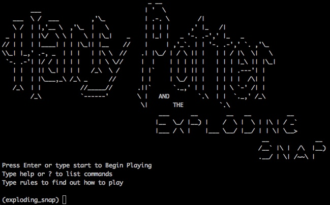
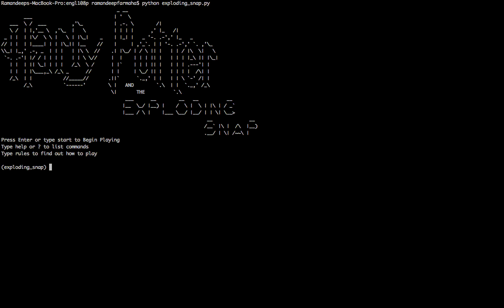
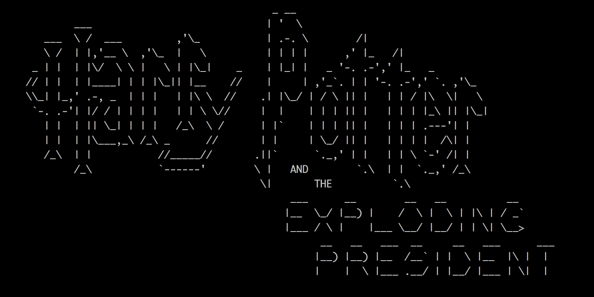

# Assignment C - engl108p

Authors: Ramandeep Farmaha, Siddhanth Unnithan

## HP-themed Exploding Snap


This is a terminal-based game, written in Python, that mimics the traditional card game of Snap, augmented for single player gameplay, with some additional "magical" elements.

### Setup

Ensure that you have Python:2.7 and PyPi package manager installed on your system. To verify if you have Python, type python --version in the console. To verify you have PyPi, type pip --version in the console.

Install the game requirements by typing: 

`pip install -r requirements.txt`

### How to Play

Run the game by entering: 

`python exploding_snap.py`

### Game Rules

- Two cards are shown at a time
- Type y if the cards are pairs, or n if they aren't
- You earn a point for every correct answer. But be careful, you lose a life if you're wrong!
- Every time you get a point, you have less time to solve the next pair
- The more lives you lose, the more likely the cards might explode!
- The game's over when you lose all your lives or if the cards explode

### Gameplay GIFs




## HP-themed President with Exploding Snap cards



This is a terminal-based game, written in Python, which replicates a subset of the original President card-game mechanics, allowing single-card plays and burns. The language used in the game messaging and client interface, makes use of Harry Potter-style wordplay. The current game configuration supports multiplayer play on a single machine. It is recommended that each player receives their own terminal instance and that each instance is displayed on its own screen, disallowing players from seeing each other's hands.

### Dependencies


Instantiation of client and game servers requires Docker installation on the machine of use. The same underlying image is used for the game and client servers, with a Python:2.7 base and a standard set of dependencies as detailed in requirements.txt.

### Setup

The current version of the game has been setup with hard-coded server 'hostname' values, corresponding to Docker containers within one network. Configuration of the docker network and containers, can be found in start-dev.sh.

Instantiating the network and underlying containers is as simple as: `bash start-dev.sh`.

If you would like to spin up more than two client servers, modify start-dev.sh. Use the following snippet of code to add a new client container to the mix:

```bash
# < > tags refer to templates that you would use to substitute your own values with

docker run -d -it -v $PWD:/App -e CLIENT_HOSTNAME=<client_name> -e GAME_SERVER_HOSTNAME=game-server -e DEV_FLAG=true --name <client_name> --network game-network game-client
```

Once the appropriate containers are up and running (check via `docker ps`), you must start the game and client servers. Note that the game server must be started before the client as the client, upon instantiation, will poll the game server in an attempt to join.

The game and client servers can be instantiated via `bash start-gs.sh` and `bash start-client.sh <client_name>`, respectively. Note that the client_name, specified as an argument to the start-client.sh script, must correspond to the client_name value provided in start-dev.sh. Instantiation of the clientz server will result in a persistent output channel that is used to transmit messages to the players; this should not be closed.

Once the game and client servers are instantiated, the _guardian_ (i.e. individual overseeing the game) must notify the game server that all of the clients have joined. This can be done via: `bash all-clients.sh`.

Each client is now expected to interact with the game server via a designated interface. It is recommended that two terminal sessions are kept side-by-side to reflect the client server output channel and the client interface. The interface can be instantiated with the following command: `bash start-interface.sh <client_name>`. Similar to the client server, the argument to the start-interface.sh script mut correspond to the client_name value provided in start-dev.sh.

### Gameplay GIFs

#### Server Instantiation

https://gfycat.com/ScrawnyFrigidBuckeyebutterfly

#### Game Dynamics

https://gfycat.com/MajorDelightfulAntlion

### Future Work
Brief notes regarding the technical details of the technical implementation can be found in notes.txt.

- multiplayer support across multiple machines
- game server deployment (Heroku, AWS)
- env-variable based client and game configuration
